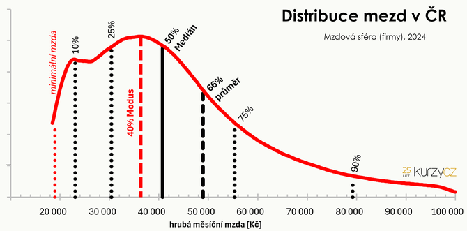

# EU27 Pension & Tax Burden Explorer

> 🚧 **Work in progress — calculation errors may be present.** This project is under active development. Country parameters, tax formulas, SSC rates, and pension calculations have not been fully audited and may contain mistakes. Results should not be treated as accurate or complete. If you spot an error, please [open an issue or submit a pull request](https://github.com/zdenk/PensionTaxExplorer/issues).

An interactive, fully client-side single-page application for exploring and comparing pension outcomes and tax burdens across the **22 EU OECD member states**. No backend required — all country data, tax tables, SSC rates and pension formula parameters are encoded as static TypeScript and computed entirely in the browser. For information and learning purposes only, not to be used for any calculations of personal finance estimations. Made with AI agent.

**Live demo:** https://zdenk.github.io/PensionTaxExplorer/

---

## ⚠️ Disclaimers

> **This tool is for illustrative and educational purposes only. It is not financial, tax, legal, or actuarial advice. Do not make retirement or financial planning decisions based on its outputs.**

> 🚧 **Work in progress — calculation errors may be present.** This project is under active development. Country parameters, tax formulas, SSC rates, and pension calculations have not been fully audited and may contain mistakes. Results should not be treated as accurate or complete. If you spot an error, please open an issue or submit a pull request.

### Illustrative model — not a personal pension forecast
All calculations model a stylised, standard employee and should be read as order-of-magnitude illustrations of how different countries' statutory systems compare structurally. Individual outcomes will differ materially based on personal circumstances, actual career history, future legislative changes, and employer arrangements.

### Present values only — no wage growth and no inflation adjustment
All monetary figures are expressed in **today's (present-value) terms** using current-year wage and parameter data. The model does **not** project future nominal amounts and makes the following simplifying assumptions:

- **Constant real wage throughout the entire career.** Real wages typically grow 2–3 % per year in the early career and flatten with age; ignoring this understates lifetime pension-eligible earnings.
- **No post-retirement pension indexation.** PAYG pensions in most countries are indexed annually to wages or prices; the replacement rate shown is the rate *at the point of retirement only* and will diverge from actual purchasing power as retirement progresses.
- **No explicit discount rate.** Future pension cash flows are not discounted back to a present value, so the "break-even age" metric is a simple nominal payback and not a financially rigorous NPV measure.

### Tax credits and personal circumstances not modelled
The income tax calculations implement **basic statutory brackets and standard employee SSC rates only**. The following are explicitly excluded and will produce materially different real-world results in many countries:

- Child tax credits and family allowances (e.g. Czech Republic, Germany Ehegattensplitting, France Quotient Familial)
- Married couple / joint filing benefits
- Disability or carer allowances
- Housing deductions and mortgage interest relief
- Voluntary private pension contribution tax relief
- Any means-tested benefits or top-ups
- **Regional and municipal income tax variation** (e.g. French communes range from approximately 29 % to 35 % in combined marginal rate; the model uses a population-weighted national average)
- **13th / 14th month bonuses** (Austria, Germany and others), which are subject to preferential tax treatment; these are flattened into an equivalent constant monthly rate

### Pension data complexity — not independently verified
Statutory pension systems across 22 countries involve hundreds of parameters (accrual rates, ceilings, indexation rules, early-retirement penalties, survivor rules, transition provisions, Pillar 2 / Pillar 3 interactions, and more). The parameters encoded in this application have been sourced in good faith from OECD, MISSOC, and national authorities, but **have not been independently audited or verified by a qualified actuary or pension specialist**.

> **Czech Republic focus:** This tool was developed primarily with the Czech system in mind. The Czech tax, SSC, and pension parameters have been verified in detail against official sources (MPSV, ČSSZ, MF ČR). Parameters for all other countries are based on OECD and MISSOC data but **have not been cross-checked with the same level of rigour** — treat non-CZ outputs with additional caution and verify key figures against national authorities before drawing conclusions. Known limitations include:

- **Finland (TyEL):** Modelled as a DB system with a longevity adjustment coefficient. This is a simplification; the correct treatment requires a dedicated `TyELConfig` type (flagged as design debt).
- **NDC annuity divisors:** Life expectancy divisors (Poland, Sweden, Italy, Latvia, Estonia) are taken from published tables but may not reflect the precise cohort-specific figures that will apply at an individual's actual retirement date. Non-standard retirement ages (e.g. age 62) fall back to the nearest available divisor rather than being interpolated, which can slightly over- or understate the pension.
- **Transition cohorts:** Most countries have transition rules for workers born before a certain year. This model applies the mature steady-state formula and does not model transition cohort adjustments.
- **Indexation:** Post-retirement pension indexation (price, wage, or mixed) is not modelled. Replacement rates shown are at the point of retirement only.
- **Second and third pillar pensions:** Voluntary or quasi-mandatory funded pillars (e.g. Danish ATP/occupational schemes, Dutch sector pension funds, Swedish PPM) are either excluded or only partially captured.
- **France AGIRC-ARRCO:** The supplementary PAYG points system is modelled as a funded-account equivalent (3 % real return) rather than as the actual PAYG points mechanism. The calibration factors are reverse-engineered to match OECD *Pensions at a Glance* replacement-rate targets, not derived from the official point pricing, and may become stale if OECD revises its methodology.
- **DB minimum pension floor:** The statutory minimum pension is applied as a flat floor with no proration for career length. Workers with a partial career (e.g. < 40 years) may see a modestly overstated minimum-pension outcome.
- **Pillar 2 funded annuity horizon:** All funded second-pillar accounts are annuitised over a fixed 20-year horizon. Some occupational schemes use a lifetime annuity (e.g. Netherlands) or a shorter fixed-term payout; the 20-year assumption is a simplification.

---

## Screenshot



*Source: [kurzy.cz — Průměr a medián mzdy](https://zpravy.kurzy.cz/826074-ostre-sledovana-mzda--prumer-a-median/)*

> **Note on wage distribution:** The shape of the wage distribution — and therefore the gap between the mean, median, and mode — is highly country-specific. In most EU countries the distribution is right-skewed, meaning the **average (mean) wage is significantly higher than the median**, and both are above the most common (mode) wage. Before interpreting any calculation, check the median and mode for the country in question: using the average wage as the "typical" worker benchmark can be misleading in countries with high wage inequality. Where possible, run the tool at 67 % AW (≈ median in many countries) alongside 100 % AW to understand how the system treats ordinary earners vs higher earners.

---

## Features

- **Side-by-side country comparison** — select up to three countries at once and compare them across all metrics
- **Career timeline modelling** — projects gross wage, net wage, SSC contributions, and pension accrual year-by-year over a full career
- **Pension outcome simulation** — calculates projected pension benefit using each country's actual statutory formula (DB, NDC, points-based, or flat-rate)
- **Replacement rate curves** — visualises net replacement rates across the wage distribution (50 % – 200 % of average wage)
- **SSC redistribution breakdown** — shows how employee and employer social security contributions are split across pension, health, unemployment, and other schemes
- **Wage breakdown table** — gross → SSC → taxable income → income tax → net at every wage level
- **Self-employment modes** — side-by-side employed vs self-employed comparison where modelled
- **Fair-return analysis** — estimates the internal rate of return on mandatory pension contributions
- **OECD benchmark comparison** — validates results against published *Pensions at a Glance* replacement rates

### Country Coverage (22 OECD EU members)

| | | | | |
|---|---|---|---|---|
| 🇦🇹 Austria | 🇧🇪 Belgium | 🇨🇿 Czech Republic | 🇩🇰 Denmark | 🇪🇪 Estonia |
| 🇫🇮 Finland | 🇫🇷 France | 🇩🇪 Germany | 🇬🇷 Greece | 🇭🇺 Hungary |
| 🇮🇪 Ireland | 🇮🇹 Italy | 🇱🇻 Latvia | 🇱🇹 Lithuania | 🇱🇺 Luxembourg |
| 🇳🇱 Netherlands | 🇵🇱 Poland | 🇵🇹 Portugal | 🇸🇰 Slovakia | 🇸🇮 Slovenia |
| 🇪🇸 Spain | 🇸🇪 Sweden | | | |

> Bulgaria, Croatia, Cyprus, Malta, and Romania (non-OECD EU members) are deferred to a future data phase.

---

## How to Use

### 1. Select Countries
Click the **Countries** dropdown in the controls bar at the top of the page to add up to three countries. Each country appears as a column. Remove a country by clicking the **×** on its chip. Some countries show a `~` indicator meaning their parameters are incomplete or indicative only.

### 2. Choose a Wage Mode
Three wage modes are available, toggled by the **× of AW / Fixed Gross / Fixed Cost** buttons:

| Mode | What it does |
|---|---|
| **× of AW** (default) | Sets the gross wage as a multiple of each country's average wage (AW). Use the slider or preset buttons (0.5×, 1.0×, 1.5×, 2.0×, 3.0×, 4.0×). This is the primary mode for cross-country comparison — the same multiple shows structurally comparable earner positions in each country. |
| **Fixed Gross EUR** | Enter a fixed monthly gross wage in EUR. The app converts to local currency using the ECB exchange rate. Cross-country comparison is at identical purchasing-power terms. |
| **Fixed Employer Cost EUR** | Enter a total monthly employer cost (gross + employer SSC). The app back-solves the gross wage for each country. Useful for comparing what a budget of, say, €5,000/month buys in each country. |

> **Tip:** In × of AW mode, 0.67× approximates the median wage in most EU countries, giving a more representative picture than 1.0× (the mean is right-skewed by high earners).

### 3. Average Wage Source
The **AW source** toggle switches between:
- **Model** — national-statistics average wage encoded in the app (Eurostat / national authority)
- **OECD TW** — OECD Taxing Wages 2025 average wage (2024 data), used as the OECD benchmark basis

These differ by a few percent for most countries and can produce noticeably different results at multiplier-mode inputs.

### 4. Career Assumptions
Click **Career Assumptions** (▶ in the controls bar) to expand the override panel:

| Control | Default | Range | Effect |
|---|---|---|---|
| **Career start age** | 25 | 16–40 | Age at which the modelled career begins; directly affects total years of SSC contributions and pension accrual. |
| **Retirement age** | Country statutory age | 55–75 | Overrides the country's statutory retirement age. Earlier retirement means fewer contribution years and, for NDC/funded systems, a lower annuity (higher divisor). |
| **Duration (yrs)** | 20 | 5–40 | Post-retirement period used for the actuarial-equivalent (fair-return) annuity calculation. Does not affect the state pension projection. |
| **Actuarial-equivalent return rate** | 3.0 % | 1.0–3.0 % real | Annual real return used to compound the hypothetical funded-equivalent account. Lower values (1–2 %) make funded investment look less attractive; 3 % is the equity-heavy upper bound. See the [methodological note](#2-the-3--real-return-default-is-optimistic) on why this matters. |

Click **Reset to defaults** to restore all career assumptions and the return rate to their initial values.

### 5. Replacement Rate Source
The **Replacement rate** toggle switches the KPI headline figure between:
- **Model** — the app's own computed gross replacement rate
- **OECD PaG** — tabulated OECD *Pensions at a Glance* gross replacement rate (interpolated at the current wage multiple)

Use Model for exploratory work; switch to OECD PaG to sanity-check and compare against the published benchmark.

### 6. Currency Display
The **EUR / Local** toggle in the controls bar switches all monetary amounts between euro and each country's local currency. In cross-currency views (multiple countries with different currencies), the local-currency display is locked to EUR.

### 7. Czech Republic Self-Employment Modes
For countries that have a modelled self-employment variant (e.g. Czech Republic OSVČ), a **SE** button appears on the country chip. Toggle it to add a self-employment column alongside the standard employee column (counts toward the 3-column maximum).

### 8. Czech Republic — Employer Benefits & DPS

When Czech Republic is selected, an **Employer Benefits** panel appears inside the CZ country card (below the KPI row). It is expanded by default and shows three statutory tax-optimised benefit components, each individually toggleable:

| Toggle | Czech name | What it models | Statutory cap (2026) |
|---|---|---|---|
| **Non-monetary benefits** | Zaměstnanecké benefity | Recreation, sport, culture, healthcare, education, transport vouchers — any non-cash benefit exempt under §6(9)(g) ZDP | ½ × AW/year ≈ **24,484 CZK/year** (slider max ≈ 2,040 CZK/month) |
| **Cash meal allowance** | Stravenkový paušál | Daily cash meal supplement paid by the employer in lieu of meal vouchers — exempt under §6(9)(b) ZDP | 70 % × 166 CZK/day × 276 working days ≈ **32,054 CZK/year** (slider max ≈ 2,671 CZK/month) |
| **Employer pension contribution** | Příspěvek na DPS / životní pojištění | Employer contributions to the employee's supplementary pension savings (Doplňkové penzijní spoření, DPS) or life insurance — exempt under §6(9)(l) ZDP | **50,000 CZK/year** combined (slider max ≈ 4,167 CZK/month) |

All three benefits are exempt from **both** employee income tax and employee/employer SSC. The slider on each row sets the monthly amount; the toggle enables or disables it entirely. The statutory caps are enforced as slider maximums.

**Important:** these benefits are employer-provided *on top of* the gross wage — they are not deducted from gross pay. Enabling them increases the employee's effective net value without increasing the employer's superordinate payroll cost (within the exemption caps), because the SSC that would otherwise apply on equivalent cash pay is saved on both sides.

#### DPS Projection callout

When the **Employer pension contribution** benefit is enabled, a purple **DPS projection** callout appears below the benefit sliders, showing:

| Field | Description |
|---|---|
| **Monthly contribution** | The enabled DPS amount in CZK/month |
| **Real return** | Annual real return applied to the DPS pot — pulled from the **Actuarial-equivalent return rate** slider in Career Assumptions (1–3 % real, default 3 %) |
| **Pot at retirement** | Accumulated DPS account balance in real (constant-price) terms at retirement, compounded at the selected return rate over the career |
| **Monthly DPS annuity** | The pot divided by the **Duration (yrs)** setting from Career Assumptions, converted to a monthly amount |

The DPS pot and the resulting monthly annuity are included in the **Total pension** KPI and in the accumulation chart (Graph 2) as a separate violet line, enabling a direct visual comparison between the state PAYG pension, the actuarial-equivalent funded scenario, and the employer DPS top-up.

> **Comparison tip:** To compare CZ against other countries on a like-for-like basis (standard employee only), disable all three benefit toggles. Enabling tax-optimised benefits gives an employer-funded advantage that is not modelled for other countries — the gap would narrow if equivalent benefits for other countries were also modelled. See the [EU-22 benefit equivalents table](#employer-tax-optimised-benefits-not-modelled--except-czech-republic) for reference amounts.

### 9. Sources Page
Click **Sources** in the top-right corner to open a full reference page listing all data sources, API endpoints, and country-specific notes.

---

## Tech Stack

| Layer | Technology |
|---|---|
| UI framework | [React 18](https://react.dev/) + [TypeScript](https://www.typescriptlang.org/) |
| Charts | [Recharts](https://recharts.org/) |
| Styling | [Tailwind CSS 3](https://tailwindcss.com/) |
| Build tool | [Vite 5](https://vitejs.dev/) |
| Deployment | [GitHub Pages](https://pages.github.com/) via GitHub Actions |

No runtime API calls. All computation happens in the browser using pure functions with zero side effects — every result is fully reproducible and auditable.

---

## Getting Started

### Prerequisites

- Node.js 18+ and npm

### Install & Run

```bash
# Clone the repository
git clone https://github.com/zdenk/PensionTaxExplorer.git
cd PensionTaxExplorer/pension-app

# Install dependencies
npm install

# Start the development server
npm run dev
```

Open http://localhost:5173 in your browser.

### Build

```bash
npm run build
```

The production build is output to `pension-app/dist/`.

### Preview Production Build

```bash
npm run preview
```

### Validation Scripts

Run the Phase 1 validation suite (checks all country configs compile and produce sane outputs):

```bash
npm run validate
```

---

## Project Structure

```
pension-app/
├── src/
│   ├── components/          # React UI components
│   │   ├── ControlsBar.tsx         # Country selector, wage mode, AW source
│   │   ├── CountryCard.tsx         # Per-country result column
│   │   ├── ComparisonCharts.tsx    # Multi-country chart panel
│   │   ├── Graph1_CareerTimeline.tsx
│   │   ├── Graph2_Accumulation.tsx
│   │   ├── Graph3_ReplacementRateCurve.tsx
│   │   ├── KPIRow.tsx
│   │   ├── SSCRedistributionTable.tsx
│   │   └── WageBreakdownTable.tsx
│   ├── data/               # Static country configs (one file per country)
│   │   ├── countryRegistry.ts
│   │   └── <country>.ts    # austria.ts, germany.ts, …
│   ├── engines/            # Pure-function calculation engines
│   │   ├── TaxEngine.ts           # Income tax (brackets, credits)
│   │   ├── SSCEngine.ts           # Social security contributions
│   │   ├── PensionEngine.ts       # Pension benefit projection
│   │   ├── TimelineBuilder.ts     # Career year-by-year timeline
│   │   └── FairReturnEngine.ts    # IRR on pension contributions
│   ├── state/
│   │   └── appReducer.ts          # React useReducer state management
│   ├── utils/
│   │   ├── computeScenario.ts
│   │   ├── formatCurrency.ts
│   │   └── resolveWage.ts
│   └── validation/         # Offline validation scripts (run with tsx)
│       ├── phase1Validate.ts
│       ├── pensionBenchmark.ts
│       └── oecdComparison.ts
└── package.json
```

---

## Data Sources

All parameters are sourced from authoritative, openly licensed datasets. The majority of values are taken directly from official publications; however, a small number are projections or calibrations:

- **Projected 2026 values** — some parameters (e.g. German Rentenwert, Durchschnittsentgelt, Polish GUS wage averages) are forward-projected from the latest available official data and will differ from the actuals once published.
- **Calibrated factors** — supplementary pension parameters for systems such as France AGIRC-ARRCO are calibrated to match OECD *Pensions at a Glance* replacement-rate benchmarks rather than derived from official point-pricing documents.

| Parameter | Source |
|---|---|
| Income tax brackets | [OECD Taxing Wages SDMX API](https://data-api.oecd.org/datasource/DSD_TAXWAGES@DF_TAXWAGES) |
| SSC rates | [MISSOC Comparative Tables](https://www.missoc.org/missoc-database/comparative-tables/) |
| Average wages | [Eurostat `earn_ses_monthly`](https://ec.europa.eu/eurostat/databrowser/view/earn_ses_monthly) / [OECD Average Wages](https://data-api.oecd.org/datasource/AV_AN_WAGE) |
| EUR exchange rates | [ECB SDMX-REST API](https://data-api.ecb.europa.eu/service/data/EXR/) |
| Pension formula parameters | [OECD *Pensions at a Glance*](https://www.oecd-ilibrary.org/finance-and-investment/pensions-at-a-glance_19991363) + national authorities |

See [EU27_Pension_Tax_Explorer_Technical_Design.md](./EU27_Pension_Tax_Explorer_Technical_Design.md) for full source documentation, API endpoints, and the annual data refresh workflow.

---

## Deploying to GitHub Pages

The repository includes a GitHub Actions workflow (`.github/workflows/deploy.yml`) that automatically builds and deploys the app to GitHub Pages on every push to `main`.

### First-time setup

1. Push this repository to GitHub.
2. Go to **Settings → Pages** in your repository.
3. Under **Source**, select **GitHub Actions**.
4. Push to `main` — the workflow will build and publish automatically.

The live URL will be:
```
https://zdenk.github.io/PensionTaxExplorer/
```

---

## Scope & Limitations

- Models a **single adult employee** with no tax-modifying personal circumstances (no children, not married, no disability).
- **Out of scope in this version:** child tax credits, married couple filing, disability allowances, housing deductions, voluntary private pension top-ups.
- Finland's TyEL system is modelled as DB with a longevity adjustment coefficient — a dedicated `TyELConfig` variant is flagged as design debt.
- Non-OECD EU members (BG, RO, HR, CY, MT) are deferred to a future Phase 6 data pack.
- **Model precision:** The validation suite compares outputs against OECD *Pensions at a Glance* benchmarks with a tolerance of ±8–12 percentage points to account for structural differences (OECD uses a career with wage growth; this model uses a constant wage). The tool is designed for **comparative illustration**, not actuarial precision.
- **Funded Pillar 2 / fair-return returns are deterministic:** All funded account projections assume a constant 3 % real annual return with no volatility, no sequence-of-returns risk, and no management fees. Actual long-term outcomes will differ materially depending on market conditions and the timing of retirement.

---

## Methodological notes & known directional biases

This tool is methodologically transparent but has several structural features that systematically tilt the fair-return comparison against PAYG systems. Users drawing conclusions from the actuarial-equivalent ("fair return") output should be aware of the following:

### 1. The actuarial-equivalent comparison is asymmetric

The funded-equivalent calculation asks: *what monthly annuity would you receive if your pension SSC had been invested at 3 % real and paid out over retirement?* For most earners above the median in any PAYG system, the answer is "more than your state pension." This makes every PAYG system look like a bad deal by construction.

The asymmetry is that PAYG systems deliver value the comparison does not price:

- **Within-cohort redistribution** — progressive benefit formulas transfer from high earners to low earners. A high earner's contributions partly fund a low earner's pension; a funded account cannot do this.
- **Longevity pooling** — PAYG pensions pay until death regardless of market conditions. The funded-equivalent annuity assumes a fixed 20-year (or set) payout horizon and a constant 3 % real return — no sequence-of-returns risk, no longevity tail.
- **Survivor and disability benefits** — most national systems include survivor pensions and disability insurance within the SSC contribution. The funded-equivalent column credits none of this.
- **Non-contributory credits** — parental leave, unemployment, sickness, and military service periods are credited by all 22 countries covered (see table below). None are modelled; see the note in the chart for interpretation guidance.

The gap between the state pension and the actuarial-equivalent annuity reflects the cost of these features, not system inefficiency alone. For a high-earning professional with a full unbroken career, almost all PAYG systems will show a gap — this is expected and does not mean the system is "worse." It is however a point for discussion about the width of the gap for different earner profiles.

### 2. The 3 % real return default is optimistic

The tool uses 3 % **real** net-of-fees as the baseline for all funded-equivalent projections. This is toward the upper end of what EU mandatory funded schemes have historically delivered, especially after management costs:

- Poland's OFE delivered significantly below this after fees and following the 2014 asset transfer to ZUS.
- Slovakia's DSS II-pillar funds have varied widely; net real returns over 20+ years are substantially below 3 % for bond-heavy default funds.
- The OECD itself uses a range of 1.5 %–3 % real in its funded-pension sensitivity analyses.

Three per cent is commonly cited in policy literature as a "long-run equity-heavy" assumption. It should be read as an upper-bound scenario, not a baseline expectation. The comparison would look less favourable for funded equivalents at 1 % or 2 % real.

### 3. The constant-wage assumption disadvantages progressive systems unevenly

The model uses a flat real wage across the entire career. Real wages typically grow 2–3 % per year in the early career and flatten with age; this understates lifetime pension-eligible earnings. The effect is not uniform across pension architectures:

- **NDC systems** (Sweden, Italy, Poland, Latvia, Estonia) accumulate based on actual contribution history — a flat wage profile understates the pot that real careers generate.
- **Best-years or final-salary DB systems** (Spain uses the last 25 years; Portugal uses career average) are less affected because the model's single wage approximates the wage used in the formula.
- **Progressive benefit formulas** (Czech Republic, Germany, Netherlands) compress replacement rates at higher earners — the constant-wage assumption does not change this, but underestimates pension for careers with genuine wage growth.

### 4. Czech Republic as validation anchor introduces framing defaults

This tool was developed primarily with the Czech system in mind (see disclaimer above). The Czech system is structurally unusual among EU OECD countries: low replacement rates by EU standards, one of the most strongly redistributive benefit formulas (the 99 %/26 %/0 % reduction thresholds), and a design that produces large gaps between high-earner contributions and benefits. Using CZ as the primary verification anchor means the tool was calibrated against a country where the PAYG "gap" is structurally large. Results for Germany, Sweden, Austria, and Ireland should be read independently and not benchmarked against Czech outcomes as if CZ were typical.

### 5. Non-contributory periods are documented but not modelled

The table below lists credited non-contributory periods (parental leave, study, unemployment, military service) for all 22 countries. **None are modelled.** For countries with generous non-contributory credits — Germany (3 years/child at full average wage), Ireland (20 years home-caring credits), Netherlands and Denmark (residence-based accrual) — the model materially understates the pension a typical earner with children or interrupted careers would actually receive. This affects the state pension column only, not the actuarial-equivalent column, which further widens the apparent gap in favour of the funded alternative.

---

## Credited Non-Contributory Periods (not modelled)

Most EU pension systems credit periods during which no contributions are paid — the state or employer either pays contributions on the worker's behalf or assigns notional earnings for that period. **None of these periods are currently modelled by this application**, which assumes a fully continuous career from start age to retirement age.

The table below documents what each country credits in principle, as a reference for interpreting the gap between model output and real-world outcomes.


The engine currently uses `careerYears = retirementAge − careerStartAge` as a flat number — none of the non-contributory periods below are modelled. This table documents the real-world rules for each country; a `creditedBonusYears` field per life-event type is planned for a future phase.


| Country | University / Study | Military Service | Parental / Child-Rearing | Unemployment | Sickness |
|---|---|---|---|---|---|
| 🇩🇪 Germany | Pre-1992: up to 7 semesters (Anrechnungszeit); **post-1992: abolished** | ✅ Wehrdienst/Zivildienst — full credit at avg wage | ✅ **3 years/child** at 100 % avg wage (Kindererziehungszeit) — most generous in EU | ✅ ALG I periods | ✅ |
| 🇦🇹 Austria | Pre-2005 old system: yes. **Post-2005 Pensionskonto: no** (voluntary buyback available) | ✅ Präsenzdienst | ✅ Up to 4 years/child (at ~⅓ avg contrib base) | ✅ | ✅ |
| 🇫🇷 France | Not automatic; can be **purchased** (rachat de trimestres) | ✅ | ✅ Maternity quarters + AVPF for stay-at-home parents | ✅ Trimestres assimilés | ✅ |
| 🇧🇪 Belgium | Not automatic; purchasable | ✅ | ✅ Maternity, time-crédit assimilated | ✅ Full assimilation | ✅ |
| 🇳🇱 Netherlands | ✅ **AOW is residence-based** (2 %/yr age 15–67) — study years in NL count as residence | ✅ (residence) | ✅ (residence) | ✅ (residence) | ✅ |
| 🇩🇰 Denmark | ✅ **Folkepension is residence-based** — same as NL | ✅ | ✅ | N/A (residence) | N/A |
| 🇸🇪 Sweden | ❌ No direct credit | ✅ Short service (small) | ✅ Parental benefit (föräldrapenning) credited | ✅ A-kassa periods | ✅ |
| 🇫🇮 Finland | ❌ Abolished | ✅ Flat amount | ✅ At 117 % of parental benefit | ✅ 75 % of benefit | ✅ 75 % of benefit |
| 🇮🇹 Italy | ❌ (NDC — only actual contributions count) | ✅ State pays minimal flat | ✅ Maternity (state credit) | ✅ State integrates | ✅ |
| 🇪🇸 Spain | ❌ | ✅ Up to 2 years | ✅ Maternity/paternity full credit | ✅ Only if cotizando | ✅ |
| 🇵🇹 Portugal | ❌ | ✅ | ✅ Maternity/paternity | ✅ Períodos de equivalência | ✅ |
| 🇬🇷 Greece | ⚠️ Pre-2016: up to 4 years first degree; **post-2016 reform: mostly abolished** | ✅ | ✅ Maternity | ✅ | ✅ |
| 🇨🇿 Czech Republic | ⚠️ Pre-2010: up to 6 years credited; **post-2010: only with voluntary contributions** | ✅ | ✅ Up to 4 years/child (parental leave) | ✅ Up to 3 years | ✅ |
| 🇵🇱 Poland | ⚠️ Counted as **non-contributory** (nieskładkowy) — accrues at 0.7 % vs contributory 1.3 %; capped at ⅓ of contributory years | ✅ Credited as contributory | ✅ Maternity/parental | ✅ Non-contributory | ✅ |
| 🇭🇺 Hungary | ⚠️ Pre-2009: credited; **post-2009 reform: abolished** | ✅ | ✅ GYES/GYED — up to 3 years/child | ✅ | ✅ |
| 🇸🇰 Slovakia | ⚠️ First degree up to 3 years credited at state expense (post-reform reduced) | ✅ | ✅ Up to 6 years | ✅ | ✅ |
| 🇸🇮 Slovenia | ⚠️ Up to 6 years first degree — **buyback option** | ✅ | ✅ | ✅ | ✅ |
| 🇪🇪 Estonia | ❌ | ✅ 12 months | ✅ State pays parental leave contributions | ✅ If benefit drawn | ✅ |
| 🇱🇻 Latvia | ❌ (NDC — only actual contributions) | ✅ State pays | ✅ State pays | ✅ State pays | ✅ |
| 🇱🇹 Lithuania | ❌ | ✅ State pays | ✅ State pays | ✅ | ✅ |
| 🇮🇪 Ireland | ❌ | ✅ | ✅ Up to 20 years home-caring credits | ✅ PRSI credits | ✅ |
| 🇱🇺 Luxembourg | ⚠️ Up to 6 semesters — **purchasable** (rachat) | ✅ | ✅ 4 years/child | ✅ | ✅ |


### Key patterns


- **Residence-based systems** (🇳🇱 NL, 🇩🇰 DK): the question is irrelevant — any year you live in the country counts, whether working, studying, or caring.
- **Germany stands out most**: 3 years per child at full average wage (Kindererziehungszeit) can add 6–9 pension points for a parent of two — the most generous child-rearing credit in the EU.
- **Study credit is disappearing**: most countries reformed it away post-2000 (CZ, HU, AT, FI, SE). Greece and Austria had significant study credits that were reduced or abolished.


> These rules are subject to change and vary significantly in duration, base amount, and eligibility conditions. Sources: MISSOC Comparative Tables, OECD *Pensions at a Glance*, national social security legislation. The Czech Republic entries have been verified in detail; entries for all other countries should be independently confirmed before use.

---

## Employer Tax-Optimised Benefits (not modelled — except Czech Republic)

Most EU countries allow employers to provide certain compensation components — meal allowances, non-monetary welfare, and contributions to occupational/supplementary pension schemes — that are partially or fully exempt from income tax and/or social security contributions. These benefits create a meaningful wedge between gross payroll cost and employee net value relative to equivalent cash pay. To compare countries with Czech Republic, exclude the Tax-Optimised benefits.

### Implemented: Czech Republic

Three benefit components are fully modelled for CZ, each togglable via a slider in the UI:

| Benefit | Czech name | Legal basis | Exemption cap (2026) | Destination |
|---|---|---|---|---|
| **Non-monetary / fringe benefits** — recreation, sport, culture, healthcare, education, transport | Zaměstnanecké benefity | §6(9)(g) zákon č. 586/1992 Sb. (ve znění zákon. č. 366/2022 Sb., účinné 2024) | ½ × AW/year ≈ **24,484 CZK/year** (≈ 2,040 CZK/month) | Employee net pay (tax & SSC exempt) |
| **Cash meal allowance** | Stravenkový paušál | §6(9)(b) zákon č. 586/1992 Sb.; Vyhláška č. 392/2024 Sb. | 70 % × 166 CZK/day × 276 days ≈ **32,054 CZK/year** (≈ 2,671 CZK/month) | Employee net pay (tax & SSC exempt) |
| **Employer pension & life-insurance contributions** | Příspěvek na DPS / životní pojištění | §6(9)(l) zákon č. 586/1992 Sb.; zákon č. 427/2011 Sb. (DPS) | **50,000 CZK/year** combined (≈ 4,167 CZK/month) | Locked third-pillar account — accumulated at 3 % real return and annuitised at retirement |

All three are exempt from **both** employee income tax and employee/employer SSC. The model caps the slider at the statutory annual exemption limit and assumes users remain within it.

---

### Not yet implemented: EU-22 country equivalents

The table below maps the three benefit categories to their nearest statutory equivalent in every other country covered by the app. None of these are currently modelled.

#### Meal voucher / food allowance

| Country | Scheme | Employer-exempt amount (approx. 2026) | Legal basis |
|---|---|---|---|
| 🇫🇷 France | *Tickets Restaurant* — employer co-pays 50–60 % | ≤ €7.18/voucher × ~22 days ≈ **€158/month** (employer portion, SSC & IT exempt) | URSSAF circular; CGI Art. 81-19° |
| 🇧🇪 Belgium | *Chèques-repas / Maaltijdcheques* — employer pays max €6.91/day, employee ≥ €1.09 | **€6.91/day × ~22 days ≈ €152/month**, fully exempt SSC + IT | CCT n°90; Loi sur les MCR |
| 🇮🇹 Italy | *Buoni pasto / Ticket restaurant* | **€8/day** (electronic) or €4/day (paper), IRPEF + SSC exempt | TUIR Art. 51(2)(c); D.Lgs. 216/2023 |
| 🇪🇸 Spain | *Tickets Restaurante / dieta manutención* | **€11/day**, IRPF + SSC exempt | Reglamento IRPF Art. 45; ET |
| 🇸🇰 Slovakia | *Stravné lístky* — employer must give ≥ 55 % of ticket value | Employer portion exempt SSC + IT within statutory meal rates | Zákonník práce §152; ZDP |
| 🇩🇪 Germany | *Essenszuschuss* via canteen or luncheon voucher | **€7.23/meal** (Sachbezugswert + €3.10 top-up) exempt IT + SSC | §8(2) EStG; SvEV 2026 |
| 🇷🇴 Romania | *Tichete de masă* | **≈ €20/working day** (indexed annually), exempt IT + SSC | Legea nr. 165/2018 |
| 🇭🇺 Hungary | *SZÉP Kártya – Vendéglátás* sub-account | **150,000 HUF/year** at preferential rate (15 % szja, no SSC vs normal marginal rates) | Szja törvény Art. 71 |
| 🇳🇱 Netherlands | Absorbed within *Werkkostenregeling* (WKR) free allowance | Employer's **1.7 % payroll free space** covers all non-cash benefits including meals | Wet LB 1964 Art. 31a |
| 🇵🇱 Poland | *ZFŚS* works-fund vouchers | **≤ 450 PLN/year** IT-exempt if disbursed from social fund | Ustawa o PIT Art. 21(1)(67) |
| 🇫🇮 Finland | *Lounasetu* (subsidised employer lunch) | Subsidised meals within **€8.80–€12.10/meal** statutory bracket (2026) — exempt | TVL § 64 |

#### Non-monetary / welfare fringe benefits

| Country | Scheme | Exempt cap (approx. 2026) | Legal basis |
|---|---|---|---|
| 🇳🇱 Netherlands | *Werkkostenregeling (WKR)* — broad free-allowance regime for all non-cash benefits | **1.7 %** of first €400k payroll + **1.18 %** above; excess taxed at 80 % *eindheffing* | Wet LB 1964 Art. 31a |
| 🇩🇪 Germany | *Sachbezugsfreigrenze* — any non-cash perk (gym, transport, etc.) | **€50/month** (€600/year) per employee, IT + SSC exempt | §8(2) EStG (Freigrenze) |
| 🇸🇪 Sweden | *Friskvårdsbidrag* — employer sport / wellness contribution | **5,000 SEK/year** (≈ €440) per employee, fully tax-free | Inkomstskattelagen (IL) 11 kap. 47§ |
| 🇮🇪 Ireland | *Small Benefits Exemption* — non-cash awards only (max 2/year) | **€1,500/year** total, fully exempt IT + PRSI + USC | TCA 1997 s.112B (Finance Act 2024) |
| 🇧🇪 Belgium | *Eco-chèques* (ecological spending vouchers) | **€250/year** per employee, exempt ONSS + IT | CCT n°98; AR 2009 |
| 🇧🇪 Belgium | *Chèques sport/culture* | **€100/quarter** (€400/year), exempt ONSS + IT | CCT n°90bis |
| 🇫🇷 France | *Œuvres sociales du CSE* — holiday vouchers (ANCV), culture, CESU | **≈ 5 % of payroll** (≈ €5,400/year per employee at AW), exempt SSC | Art. L.2312-77 C. trav.; URSSAF circular 2026 |
| 🇫🇮 Finland | *Liikuntaetu* — sport and culture employer benefit | **€400/year** per employee, IT + SSC exempt | TVL §§ 69, 69b |
| 🇦🇹 Austria | *Zukunftssicherung* — group life/health/accident insurance premium | **€300/employee/year** exempt IT + SSC | EStG §3(1)(15)(a) |
| 🇮🇹 Italy | *Welfare aziendale* / fringe benefits (broad basket) | **€258.23/year** standard (raised to **€1,000/year** for employees with a dependent child, D.Lgs. 216/2023) | TUIR Art. 51(3) |
| 🇭🇺 Hungary | *SZÉP Kártya – Szálláshely* (accommodation) + *Szabadidő* (leisure) | **225,000 / 75,000 HUF/year** respectively at SZJA-preferential rate | Szja törvény Art. 71 |
| 🇩🇰 Denmark | Various *personalegoder* — transport pass, broadband, fitness | **≤ DKK 7,400/year** standard net limit before excess is taxed as wages | LL §16 |
| 🇱🇺 Luxembourg | *Avantages en nature* — meals, sport, culture | Up to **€3,000/year** IT-exempt via employer welfare schemes | LIR Art. 95 |

#### Employer pension & life-insurance contributions

| Country | Vehicle / scheme | Annual exempt cap (approx. 2026) | Legal basis |
|---|---|---|---|
| 🇩🇪 Germany | *bAV* — Direktversicherung / Pensionskasse / Pensionsfonds | **8 % of BBG** = **€8,112/year**, IT + SSC exempt; additional **€1,800/year** IT-only exempt | §3 Nr.63 EStG; §1 BetrAVG |
| 🇳🇱 Netherlands | *Pensioen* — collective occupational (Witteveenkader) | No EUR cap; limited by **1.875 % accrual/year × career average**; contributions fully IT + SSC exempt | Wet IB 2001 Art. 1.7; Wet LB 1964 Art. 19a |
| 🇫🇷 France | *PER collectif (PERECO)* employer abondement | **16 % of PASS** ≈ **€9,664/year** IT-exempt; employer portion SSC-exempt to the same ceiling | CGI Art. 163 quartervigies; CSS L.137-16 |
| 🇧🇪 Belgium | *Assurance-groupe / 2e pijler ELP* | No fixed cap; limited by the **"80 % final salary"** ceiling rule; contributions at 4.4 % long-term saving tax (vs marginal IT + SSC) | WAP; WIB 92 Art. 52 |
| 🇸🇪 Sweden | *Tjänstepension* (ITP / SAF-LO / ITPK) | No employee IT cap (exempt until drawdown); employer pays *särskild löneskatt* **24.26 %** instead of full employer SSC **31.42 %** | IL 28 kap.; SFS 1990:659 |
| 🇮🇪 Ireland | *Occupational Pension Scheme* employer contributions | **No cap** on employer contributions (IT + PRSI exempt); employee AVC relief: age-banded 15–40 % of earnings | TCA 1997 Part 30 |
| 🇦🇹 Austria | *BMSVG* (mandatory 1.53 % "Abfertigung Neu") + *Pensionskasse* / *BKV* | Mandatory BMSVG 1.53 % fully exempt; voluntary Pensionskasse contributions exempt to **€300/year** general fringe cap — additional via EStG §26(7) | EStG §3(1)(15)(a); BMSVG §6 |
| 🇮🇹 Italy | *Fondi pensione complementare (FIP)* | **€5,164.57/year** combined employer + employee contributions, IRPEF + SSC exempt | D.Lgs. 252/2005 Art. 8(4) |
| 🇸🇰 Slovakia | *DDS — Doplnkové dôchodkové sporenie* | Employer contribution SSC-exempt (no cap); IT-exempt up to **6 % of gross salary** | Zákon č. 650/2004 Z.z.; ZDP §5(7)(c) |
| 🇵🇱 Poland | *PPE* (voluntary) + *PPK* (mandatory) | PPE employer contribution up to **7 % of salary** IT-exempt; PPK mandatory portion IT-exempt (SSC not exempt) | Ustawa o PPK; Ustawa o PPE |
| 🇭🇺 Hungary | *Önkéntes nyugdíjpénztár* (voluntary pension fund) | Employer contribution up to **≈ 50,000 HUF/year** IT-exempt | Szja törvény §7(1) |
| 🇩🇰 Denmark | *Arbejdsmarkedspension* — sector mandatory occupational | All occupational pension contributions deductible / IT-exempt until drawdown | PBL §§ 19, 41 |
| 🇫🇮 Finland | *TyEL* supplementary + voluntary employer pension insurance | TyEL contributions fully IT + SSC exempt; voluntary additions via *henkilövakuutus* | TVL §§ 96a, 98 |
| 🇬🇷 Greece | *Ταμεία επαγγελματικής ασφάλισης (ΤΕΑ)* | Employer contributions up to **6 % of pensionable salary** IT-exempt | Law 3029/2002; KFE Art. 3 |
| 🇵🇹 Portugal | *PPR / Planos de pensões* employer contributions | Up to **€1,800/year** (employee) IT-exempt via Art. 21 EBF; employer side deductible (no personal IT cap) | EBF Art. 21; CIRS Art. 78-A |
| 🇱🇻 Latvia | *Privātie pensiju fondi* / 3rd pillar | Employer contributions IT-exempt up to **10 % of gross salary** (≤ €4,000/year) | Likums par IIN Art. 10 |
| 🇱🇹 Lithuania | *Papildomos pensijų kaupimas* (voluntary 3rd pillar) | Employer contributions IT-exempt up to **25 % of gross** (max €75/month) | GPM įstatymas Art. 17 §1(19) |
| 🇪🇪 Estonia | *Täiendav pensionikindlustus* (voluntary 3rd pillar) | Employer contributions IT-exempt up to **15 % of gross salary** | TMS § 28 |
| 🇸🇮 Slovenia | *Pokojninsko dodatno zavarovanje (PZ)* | Employer contributions IT-exempt up to **5.844 % of gross** (≤ €2,984/year) | ZDoh-2 Art. 117 |
| 🇱🇺 Luxembourg | *Régime complémentaire de pension (RCP)* | Employer contributions IT-exempt with no fixed monetary cap (subject to "définitivité des droits" rules) | LIR Art. 111; Loi RCP 1999 |

> **Implementation note:** The `EmployerBenefitDef` type in `types.ts` is designed to be country-agnostic. Adding a country's benefits requires populating an `employerBenefits` block in the country data file — no engine changes are needed. Germany (bAV, €8,112 cap), the Netherlands (WKR, 1.7 % payroll), France (CSE welfare + PER), and Slovakia (DDS, 6 % of gross) represent the highest-impact additions relative to a standard AW earner.

---

## License

MIT — see [LICENSE](./LICENSE) for details.

Data reproduced from OECD, Eurostat, MISSOC, and ECB sources is subject to their respective open-data licences (OECD Terms, CC BY 4.0, ECB open data). See the technical design document for full attribution.
